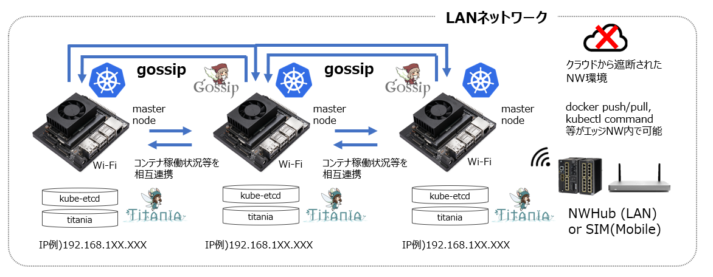

<p align="center">  </p>
<p align="center"></p>

***  

# titaniadb
titaniadbは、高速で高可用性が特徴の分散型KVSであるetcdをラップした、主にエッジコンピューティングのためのデータストアです。
Kubernetes上で動作するAIONエコシステムと協調するようになっています。  


# etcdについて
## 概要
etcdは、分散型のKVS(Key Value Store)です。コンセンサスをベースとした分散型のシステムであり、構成データをクラスタ内に分散化させることで、
高い冗長性とリカバリー性能を実現しています。
また、I/Oが高速です（1000/s）
etcdはkubernetesのプライマリデータストアに採用されています。
## データ構造
データはjson形式で保存されます。そのため、既存のサービスとの互換性が高く、気軽に使い始めることができます。
## セキュリティー
SSLによる通信の暗号化をオプションでサポートしています。

# etcdctl
etcdをCUIで操作するには下記の2通りの手段があります。

* etcdctl（専用のCLIツール）
* curl

curlを使用すると、一般的なHTTPリクエストと同じ形式でデータの操作が可能です。

## etcdctlのインストール
### インストール方法
```
ETCD_VERSION=${ETCD_VERSION:-v3.3.1}
curl -L https://github.com/coreos/etcd/releases/download/$ETCD_VERSION/etcd-$ETCD_VERSION-linux-arm64.tar.gz -o etcd-$ETCD_VERSION-linux-arm64.tar.gz
tar xzvf etcd-v3.3.1-linux-arm64.tar.gz
rm -rf etcd-v3.3.1-linux-arm.tar.gz
cd etcd-v3.3.1-linux-arm64
sudo cp etcdctl /usr/local/bin/
```

### 2. インストール確認
下記のコマンドでversion情報が表示されればインストール完了
`etcdctl --version`
```
etcdctl version: 3.3.1
API version: 2
```

### 3. bashの設定

`$ vi ~/.bashrc`
```
export ETCDCTL_API=3
alias e='etcdctl --endpoints="localhost:30079"'
```

### 4. bashの更新
`$ source ~/.bashrc`

## コマンド例
#### 全てのデータを取得する
`$ e get --prefix ""`
#### 特定のprefixのデータを取得する
`$ e get --prefix "hoge"`

#### 全てのデータを削除する
`$ e delete --prefix ""`
#### 特定のprefixのデータを削除する
`$ e delete --prefix "hoge"`
